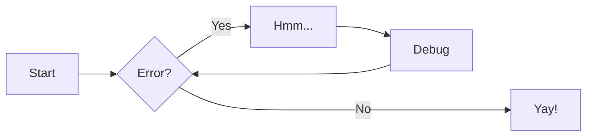
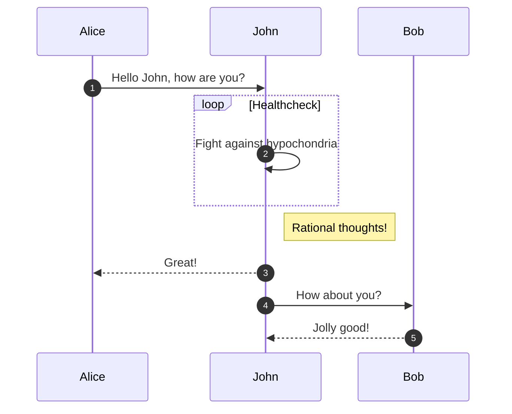
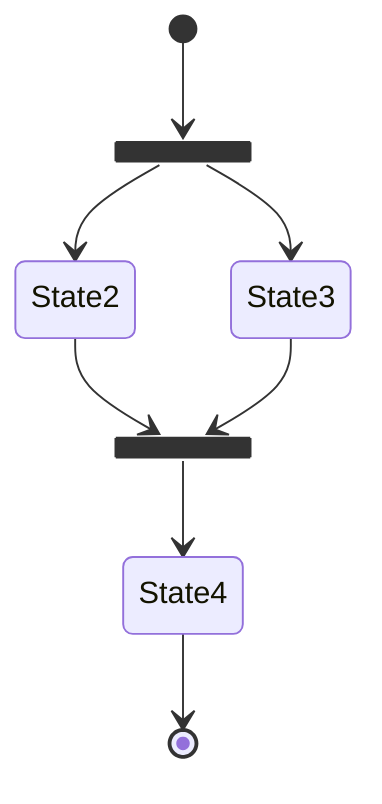
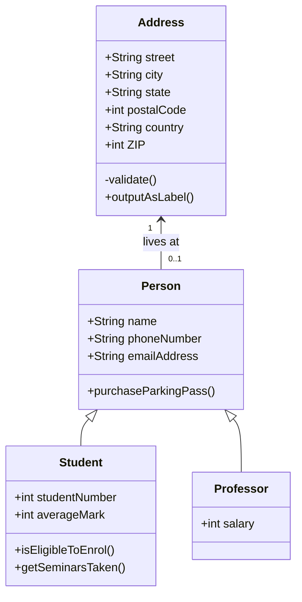

# Homepage

For full documentation visit [mkdocs.org](https://www.mkdocs.org).

## Code Annotation Examples

### Codeblocks

Some `code: print('Hello, world!')` goes here

## Plain codeblock

A plain codeblock

```py title='🐍 custom.py' linenums='1' hl_lines='1 3'
# Some code here
def say_hi():
    print('Hi!')
```

:fontawesome-brands-twitter:{ .twitter }

:fontawesome-brands-facebook:{ .facebook }

:octicons-heart-fill-24:{ .heart }

=== "C"

    ``` c
    #include <stdio.h>

    int main(void) {
      printf("Hello world!\n");
      return 0;
    }
    ```

=== "C++"

    ``` c++
    #include <iostream>

    int main(void) {
      std::cout << "Hello world!" << std::endl;
      return 0;
    }
    ```

!!! example

    === "Unordered list"

        * Sed sagittis eleifend rutrum
        * Donec vitae suscipit est
        * Nulla tempor lobortis orci

    === "Ordered list"

        1. Sed sagittis eleifend rutrum
        2. Donec vitae suscipit est
        3. Nulla tempor lobortis orci

# My Documentation

- Example Tab 1

  - Content for Tab 1

- Example Tab 2

  - Content for Tab 2

- Example Tab 3
  - Content for Tab 3

Lorem ipsum[^1] dolor sit amet, consectetur adipiscing elit.[^2]

[Send :fontawesome-solid-paper-plane:](#){ .md-button }

| Method   | Description                          |
| -------- | ------------------------------------ |
| `GET`    | :material-check: Fetch resource      |
| `PUT`    | :material-check-all: Update resource |
| `DELETE` | :material-close: Delete resource     |



_Example_



_State Diagrams_



_Class Diagram_



[^1]: Lorem ipsum dolor sit amet, consectetur adipiscing elit.
[^2]: Lorem ipsum dolor sit amet, consectetur adipiscing elit.

_Card Grid_

<div class="grid cards" markdown>

- :fontawesome-brands-html5: **HTML** for content and structure
- :fontawesome-brands-js: **JavaScript** for interactivity
- :fontawesome-brands-css3: **CSS** for text running out of boxes
- :fontawesome-brands-internet-explorer: **Internet Explorer** ... huh?

</div>

:octicons-heart-fill-24:{ .heart }
